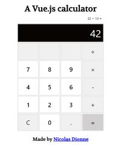

# Vue-Calculator

<p align="center">
  A simple Vuejs calculator that supports basic operations (+,-,/,*) and float numbers. </br >
  <p align="center">
    
  </p>
</p>

## Project setup
```
npm install

npm run serve
```Cancel changes
## TODO

- Square and square Root operations buttons
- Parantheses button
- Undo button
- Negative/Positive button
- Responsive design
